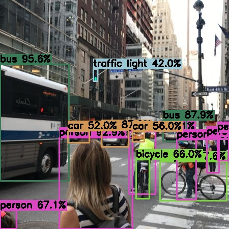

# 🟢 YOLOv8s Object Detection

Detect objects *in real-time* or *on static images* using *YOLOv8 small (yolov8s.pt)*!  
Perfect for experimenting with computer vision and AI. 🖥📸🤖

---

## ✨ Features

- 🖥 *Live Webcam Detection*: Smooth threaded video capture  
- 🖼 *Static Image Detection*: Predict objects on any image  
- 🌈 *Color-coded Classes*: Each class has a unique color (static images)  
- 📦 Detects multiple objects: people, devices, and more  
- 🎨 Draws *bounding boxes* + *class labels* + *confidence scores*  
- ⚡ Optimized for faster performance with YOLOv8s

---

## 🖼 Example Output

  

---

## 📦 Requirements

- Python 3.8+  
- OpenCV  
- Ultralytics YOLO  
- Matplotlib (for notebook display)

## Install dependencies:
pip install opencv-python ultralytics matplotlib

---

## 👩‍💻 How to Use

1️⃣ Live Webcam Detection

1. Open the script or notebook cell for webcam detection.

2. Run the code – the webcam will open with live object detection.

3. Press q to quit the window.

4. Enjoy watching YOLOv8s detect objects in real-time! 🎯

2️⃣ Static Image Detection

1. Place your image in the project folder (e.g., caption.jpg).

2. Run the image detection script/notebook cell.

3. The processed image will display in the notebook with:

Bounding boxes

Class labels

Confidence scores

Unique colors per class 🌈

4. Image is automatically saved as example_detection.jpg (or in images/ folder).

---

📝 Notes

Make sure YOLOv8s (yolov8s.pt) is downloaded in your working directory.

For best readability, keep output images in an images/ folder.

Adjust confidence threshold (conf) if you want stricter or looser detection.
