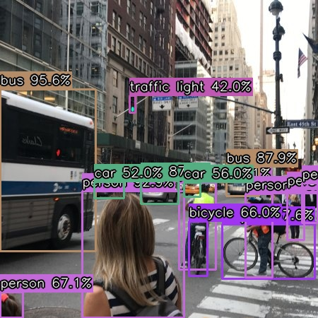

# 🟢 YOLOv8 Object Detection

This project demonstrates object detection using **two YOLOv8 models**:  

- ⚡ **YOLOv8n (Nano)** → used for **real-time webcam detection** (faster, lighter, good for live streams).  
- 🎯 **YOLOv8s (Small)** → used for **static image detection** (more accurate, better for single images).  

With this setup, you can **balance speed and accuracy** depending on whether you are detecting objects in a live video stream or analyzing static images. 🖥📸🤖  

---

## ✨ Features

- 🖥 **Live Webcam Detection** → YOLOv8n for smooth real-time performance.  
- 🖼 **Static Image Detection** → YOLOv8s for higher accuracy on single images.  
- 🌈 **Color-coded Classes (Static Images)** → Each class has a unique color for clarity.  
- 📦 **Multiple Objects Detection** → People, devices, everyday items, and more.  
- 🎨 **Bounding Boxes + Labels + Confidence Scores** → Easy-to-read overlay.  
- ⚡ **Optimized Performance** → Choose between YOLOv8n (speed) and YOLOv8s (accuracy).  

---

## 🖼 Example Output

### Webcam Detection (YOLOv8n)  
Real-time bounding boxes and labels drawn directly on video frames.  

### Static Image Detection (YOLOv8s)  
  

---

## 📦 Requirements

- Python 3.8+  
- OpenCV  
- Ultralytics YOLO  
- Matplotlib (for static image visualization)  

### Install dependencies:

pip install opencv-python ultralytics matplotlib

## 👩‍💻 How to Use
1️⃣ Live Webcam Detection (YOLOv8n)
Run the webcam script.

Your webcam will open and start showing detections in real time.

Press q to quit.

YOLOv8n is used for fast performance on video streams.

2️⃣ Static Image Detection (YOLOv8s)
Place your image in the project folder (e.g., input.jpg).

Run the image detection script.

The processed image will display with:

✅ Bounding boxes

✅ Class labels

✅ Confidence scores

✅ Unique class colors 🌈

The result is automatically saved as output.jpg.

YOLOv8s is used for better accuracy on static images.

## 📝 Notes
Ensure the required YOLO models (yolov8n.pt and yolov8s.pt) are downloaded in your working directory.

For better organization, save processed images inside an images/ folder.

Adjust confidence threshold (conf) for stricter or looser detections.

Webcam detection uses threading for smoother frame capture.
